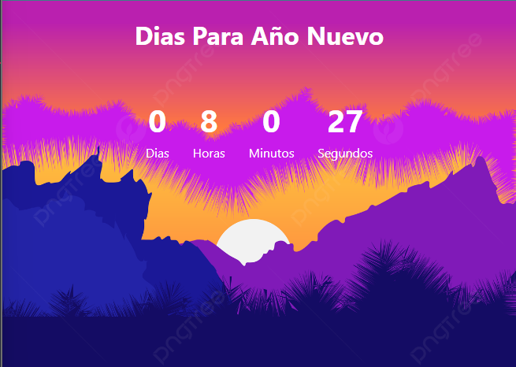

# Temporizador de Fin de Año

Este proyecto consiste en un temporizador simple para contar el tiempo hasta el fin de año 2023. 

## Funcionalidades

- Muestra el tiempo restante hasta la medianoche del 31 de diciembre.
- Actualización automática del tiempo restante.
- Interfaz minimalista y fácil de usar.

## Uso
Simplemente abre el archivo `index.html` en tu navegador para comenzar a utilizar el temporizador.

## Captura de pantalla

## Tecnologías utilizadas

- HTML5
- CSS3
- JavaScript